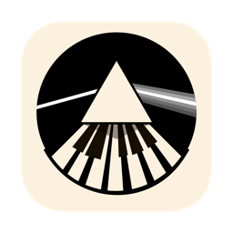

# Prisma

## Transform Your Synthesizers into Polyphonic Multi-Synth Orchestra

Prisma - synthesizer orchestration

The problem: Previously, using multiple monophonic synthesisers, you could not play them simultainisly, now you can!

Prisma is a cutting-edge program designed to bridge the gap between a single MIDI keyboard and the vast potential of multiple monophonic synthesizers ( Plugins and hardware ). By intelligently processing MIDI input, Prisma enables musicians to play across several synths as if they were a unified, polyphonic instrument. This tool listens to MIDI input on channel 16 and dynamically splits incoming chords across various channels, allowing for intricate compositions using monophonic synthesizers.

### Key Features at a Glance

* Dynamic Splitting: Distributes notes from a chord across multiple channels, seamlessly integrating with your synths.

* Solo and Clone Modes: Offers the flexibility to direct all notes to a single channel or duplicate incoming notes across selected channels.

* Channel Remap: Provides total control over MIDI signal routing, enhancing your setup's versatility.

* Arpeggiator: Adds rhythm and texture by converting chords into sequenced notes, following user-defined patterns and tempo.

## Getting Started

### Prisma Interface

Prisma invites you to select your hardware input device and configure it to your liking, despite the current limitation of not directly selecting an output device, a workaround involving your DAW is suggested until future updates address this.

## Setup and Configuration

### Device Selection

After choosing your input device, configure the device to send on channel 16. The program offers a variety of modes and settings to tailor the MIDI routing to your creative needs, showcased in the detailed controls section.

### Controls

* FloatWindow: Ensures Prisma remains accessible by staying on top.
* Latch: Sustains notes indefinitely for a drone-like effect.
* Panik: Instantly stops all notes, clearing the current MIDI state.

### Dive into Creativity

Setup Example

    Connect your MIDI device.
    Choose your mode: split, solo, clone, remap, or arp, and tweak the settings to your preference.
    Play and explore the new dimensions Prisma adds to your musical expression.

### Configuration

Enable Prisma virtual device

Useful setup, here we are listening on channel-16 from Prisma and also sending to Prisma on channel-16

For sync to work we need to activate MIDI MTC, in Pro Tools this can be done from the transport

and also enable the MIDI clock

### Limitations and Considerations

Prisma is in active development, with certain features like the arpeggiator mode still being refined. Users are encouraged to experiment with these tools, keeping in mind the evolving nature of the software.

Known issues:

* Arpeggiator will only sync start and stop from the DAW, MIDI clock sync is being worked on
* Direct selection of otput device is not possible at the moment. Workaround is to make the selection on your DAW

## Requirements

    A MIDI interface or software for MIDI channel routing.
    Compatible MIDI sending software or hardware.

## Further Information

For any questions, support, or feedback, please reach out through [maintainer's email or project's issue tracker].

Transform your musical setup with Prisma and unlock new realms of creativity by seamlessly integrating monophonic synthesizers into your compositions.

## App Icon

